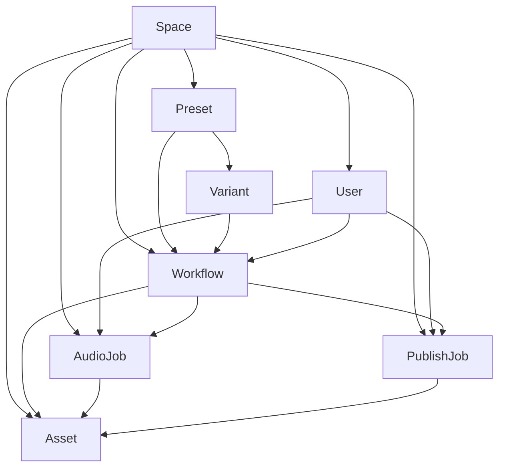

# Domain Model v1

**Owner:** Jarvis  
**Reviewer:** Smith  
**Stand:** 2026-03-29  
**Welle:** B01  
**Typ:** Spike  
**Bereich:** Product Core

---

## Zweck

Dieses Dokument beschreibt ein erstes fachliches Domain-Modell für das Projekt.
Es trennt dabei bewusst zwischen:

- **heutigem Ist-Zustand** im bestehenden Repo
- **zielgerichtetem v1-Modell** für die nächste Ausbaustufe

Der Zweck ist nicht, sofort alles technisch umzubauen, sondern ein gemeinsames Vokabular und stabile Kernobjekte festzulegen.

---

## Ziel des Modells

Das System soll nicht länger primär über Pfade, Slugs, Dateinamen und Flow-spezifische Sonderfälle verstanden werden, sondern über klar benannte Kernentitäten.

Im Fokus stehen für v1 diese Entitäten:

- **Workflow**
- **AudioJob**
- **PublishJob**
- **Asset**
- **Preset**
- **Variant**
- **User**
- **Space**

---

## Design-Prinzipien

### 1. Workflow ist das zentrale fachliche Objekt
Ein Nutzer startet nicht „ein paar Skripte“, sondern einen **Workflow** mit Ziel, Parametern, Assets und Status.

### 2. Jobs sind Ausführungen, nicht das Produkt selbst
Audio-Erzeugung und Publishing sind **Jobs**, die zu einem Workflow gehören, aber nicht dessen Identität ersetzen.

### 3. Presets und Variants sind Produktlogik
Haus, Stimmung, Defaults, Titelvorlagen, Audio-Prompts und Bildlogik sind keine losen UI-Hilfen, sondern fachliche Konfiguration.

### 4. Assets sind erstklassige Objekte
Audio, Thumbnail, Video, Metadata und Hintergrundbilder sollten als referenzierbare Assets gedacht werden, nicht nur als Dateien mit implizitem Dateinamenvertrag.

### 5. Multi-User / Multi-Space wird vorbereitet
Auch wenn heute operativ klein, sollte das Modell nicht künstlich nur auf eine Einzelperson oder ein einziges Projekt fest verdrahtet sein.

---

## Heute vs. v1

## Heutiger Zustand
Der aktuelle Stand ist funktional, aber fachlich noch stark über Infrastruktur und Dateiablagen modelliert:

- Dashboard arbeitet mit Formularen, Slugs und Hidden Fields
- Audio-Jobs haben bereits eine erkennbare Eigenständigkeit
- Pipeline-Läufe und Uploads sind vorhanden, aber nicht durchgehend als eigenständige Domain-Objekte modelliert
- Assets leben vor allem als Dateien in `data/upload/` und `data/output/`
- House Templates enthalten Preset- und Variantenlogik, aber noch nicht als explizite Domain-Objekte mit stabiler Identität

Kurz: **Das Verhalten ist da, das Modell ist noch implizit.**

## Zielbild v1
Im Zielbild wird jeder relevante Kernbereich fachlich benannt und mit klaren Beziehungen beschrieben.  
Dateipfade bleiben technische Umsetzung, aber nicht mehr die primäre Denkeinheit.

---

## Kernentitäten

## 1. Workflow

### Bedeutung
Ein **Workflow** ist der zentrale fachliche Vorgang zur Erstellung und optionalen Veröffentlichung eines Contents.

Er bündelt:
- Nutzerabsicht
- gewähltes Preset / Variant
- gewünschte Dauer / Stil / Parameter
- referenzierte Eingangs- und Ausgangs-Assets
- Status über den Gesamtprozess

### Beispiele
- „Erstelle neues 3h-Video für Old Valyria / Dragonstone“
- „Erzeuge Short aus vorhandenem Longform-Video“
- „Nutze Library-Audio und veröffentliche final auf YouTube“

### Minimale Felder (v1)
- `id`
- `space_id`
- `created_by_user_id`
- `type` (`longform_video`, `short`, später erweiterbar)
- `status` (`draft`, `ready`, `running`, `needs_review`, `completed`, `failed`, `canceled`)
- `preset_id`
- `variant_id` (optional je nach Workflow-Typ)
- `title`
- `slug`
- `configuration` (normalisierte Workflow-Parameter)
- `current_audio_asset_id` (optional)
- `current_thumbnail_asset_id` (optional)
- `current_video_asset_id` (optional)
- `publish_target` / `publish_intent`
- `created_at`, `updated_at`

### Verantwortung
Workflow ist die **fachliche Klammer** über alle Jobs und Assets.

---

## 2. AudioJob

### Bedeutung
Ein **AudioJob** ist eine konkrete Ausführung zur Audio-Erzeugung oder Audio-Aufbereitung.

### Heute sichtbar als
- GPU Worker Jobs
- Audio-Lab-Erzeugungen
- Laufende / historische Audio-Generierungen

### Minimale Felder (v1)
- `id`
- `workflow_id` (optional, falls frei im Audio Lab gestartet)
- `space_id`
- `created_by_user_id`
- `provider` (`stable-audio-local`, später weitere)
- `status` (`queued`, `running`, `completed`, `failed`, `canceled`)
- `prompt_payload`
- `generation_parameters`
- `result_audio_asset_id` (optional)
- `logs_ref` / `error_summary`
- `created_at`, `started_at`, `finished_at`

### Abgrenzung
Ein AudioJob beschreibt **die Ausführung**, nicht das Preset und nicht das finale Content-Objekt.

---

## 3. PublishJob

### Bedeutung
Ein **PublishJob** ist eine konkrete Veröffentlichungsausführung auf ein externes Ziel.

### Heute sichtbar als
- YouTube-Upload via OAuth / API
- manueller oder automatischer Upload aus dem Workflow heraus

### Minimale Felder (v1)
- `id`
- `workflow_id`
- `space_id`
- `created_by_user_id`
- `platform` (`youtube`)
- `status` (`queued`, `running`, `completed`, `failed`, `canceled`)
- `input_video_asset_id`
- `input_thumbnail_asset_id` (optional)
- `input_metadata_asset_id`
- `privacy`
- `external_reference` (z. B. YouTube video id)
- `error_summary`
- `created_at`, `started_at`, `finished_at`

### Abgrenzung
PublishJob ist **nicht** der Workflow und **nicht** der veröffentlichte Content als solcher, sondern die Ausführung des Uploads.

---

## 4. Asset

### Bedeutung
Ein **Asset** ist jedes relevante, versionierbare oder referenzierbare Artefakt, das in Workflows und Jobs verwendet oder erzeugt wird.

### Asset-Typen (v1)
- `audio`
- `thumbnail`
- `background`
- `video`
- `metadata`
- `prompt_bundle` (optional)
- `log` / `report` (optional, später)

### Minimale Felder (v1)
- `id`
- `space_id`
- `asset_type`
- `status` (`available`, `draft`, `archived`, `invalid`)
- `storage_path`
- `mime_type` / `format`
- `origin` (`uploaded`, `generated`, `imported`, `derived`)
- `created_by_user_id` (optional)
- `source_workflow_id` (optional)
- `source_job_id` (optional, polymorph gedacht)
- `metadata_json`
- `created_at`

### Warum wichtig
Aktuell trägt oft der Dateiname die Wahrheit. Im v1-Modell trägt **das Asset-Objekt** die Wahrheit; der Pfad wird Implementierungsdetail.

---

## 5. Preset

### Bedeutung
Ein **Preset** ist eine produktseitige Konfigurationseinheit für eine Content-Familie.

Im aktuellen Projekt entspricht das grob einem **Haus-/Theme-Preset**.

### Enthält fachlich
- Name / Identität
- Stimmung und Markensprache
- Standardwerte für Audio / Dauer / Übergänge
- Musikrichtlinien
- Thumbnail-Richtlinien
- Titelvorlagen
- Variantenliste

### Minimale Felder (v1)
- `id`
- `space_id`
- `key`
- `display_name`
- `house_name` / `franchise_label` (falls weiter generalisiert)
- `mood_profile`
- `default_configuration`
- `music_brief`
- `thumbnail_brief`
- `title_template`
- `status` (`active`, `draft`, `archived`)
- `created_at`, `updated_at`

### Abgrenzung
Preset ist die **wiederverwendbare Vorlage**, nicht die konkrete Content-Ausführung.

---

## 6. Variant

### Bedeutung
Eine **Variant** ist eine untergeordnete Ausprägung eines Presets.

Im aktuellen Projekt entspricht das grob einem Ort / Unterthema innerhalb eines Hauses, z. B. bestimmte Sitze oder Regionen.

### Enthält fachlich
- Name und Beschreibung der Variante
- variantenspezifische Audio-Prompts
- Hintergrund-/Bildbezug
- ggf. variantenspezifische Overrides

### Minimale Felder (v1)
- `id`
- `preset_id`
- `space_id`
- `key`
- `display_name`
- `description`
- `audio_prompt_bundle`
- `background_brief`
- `override_configuration` (optional)
- `status` (`active`, `draft`, `archived`)
- `sort_order`

### Abgrenzung
Variant ist keine freie Nutzerwahl ohne Kontext, sondern gehört immer zu genau einem Preset.

---

## 7. User

### Bedeutung
Ein **User** ist ein handelnder Akteur im System.

Auch wenn aktuell viele Aktionen informell laufen, ist für das Domain-Modell wichtig, zwischen menschlichen und später ggf. systemischen Ausführern zu unterscheiden.

### Minimale Felder (v1)
- `id`
- `space_id` oder Membership-Beziehung
- `display_name`
- `role` (`admin`, `editor`, `operator`, später granularer)
- `status` (`active`, `disabled`)
- `auth_provider` (optional)
- `created_at`, `last_seen_at`

### Hinweis
Für v1 geht es primär um fachliche Existenz, nicht um vollständiges IAM-Design.

---

## 8. Space

### Bedeutung
Ein **Space** ist der organisatorische Container für Inhalte, Konfiguration und Nutzerkontext.

Im kleinen Setup entspricht ein Space zunächst praktisch dem Projekt / der Instanz.  
Langfristig erlaubt er aber Trennung nach Team, Mandant, Brand oder Content-Line.

### Minimale Felder (v1)
- `id`
- `key`
- `display_name`
- `status`
- `settings_json`
- `created_at`

### Nutzen
Space verhindert, dass das Modell heimlich nur für genau ein Projekt und genau einen Operator geschrieben ist.

---

## Beziehungen

## Primäre Beziehungen

- **Space 1 → n Users**
- **Space 1 → n Presets**
- **Space 1 → n Workflows**
- **Space 1 → n Assets**
- **Space 1 → n AudioJobs**
- **Space 1 → n PublishJobs**

- **Preset 1 → n Variants**
- **Preset 1 → n Workflows**

- **Variant 1 → n Workflows**

- **Workflow 1 → n AudioJobs**
- **Workflow 1 → n PublishJobs**
- **Workflow 1 → n Assets** (direkt oder abgeleitet referenziert)

- **AudioJob 0..1 → 1 result Audio Asset**
- **PublishJob nutzt 1 Video Asset + optionale weitere Assets**

- **User 1 → n Workflows**
- **User 1 → n Jobs**
- **User 1 → n Assets** (bei Upload / Erstellung)

---

## Merksatz

- **Preset** definiert die Welt
- **Variant** schärft die Auswahl
- **Workflow** ist die Absicht + der Gesamtvorgang
- **AudioJob** und **PublishJob** sind Ausführungen
- **Asset** sind die Ergebnisse / Inputs
- **User** handelt
- **Space** begrenzt den Kontext

---

## Visuelles Modell

---

## Heutiges Mapping auf bestehende Repo-Strukturen

| Heutiger Bereich | Fachliches Zielobjekt |
|---|---|
| `services/sync/data/house_templates.json` | Preset + Variant |
| Audio Lab / Audio Jobs UI | AudioJob |
| Create Video / Pipeline Run | Workflow |
| `data/upload/songs/` | Audio Asset |
| `data/upload/metadata/` / generierte metadata.json | Metadata Asset |
| `data/output/youtube/.../video.mp4` | Video Asset |
| `data/output/youtube/.../thumbnail.jpg` | Thumbnail Asset |
| YouTube Upload Script / Logs | PublishJob |
| Dashboard-Bedienung heute | User-Aktion im Space |

---

## Was bewusst noch nicht modelliert wird

Diese Themen sind wichtig, aber **nicht Teil von v1**:

- vollständiges Rechtesystem / IAM
- feingranulare Team-Memberships
- Billing / Usage Tracking
- Versionierung von Presets als eigener Lifecycle
- generisches Queue-/Lease-/Execution-Modell für alle Worker
- vollständige Event-Sourcing- oder Audit-Log-Architektur
- Multi-platform publishing über YouTube hinaus

Diese Themen dürfen folgen, sollten aber das v1-Modell nicht unnötig aufblasen.

---

## Offene Modellfragen

### 1. Gehört `Variant` immer zwingend zu `Preset`?
Aktuell: ja.  
Empfehlung v1: **ja**, weil das Modell dadurch klarer bleibt.

### 2. Ist `PublishJob` Teil des Workflows oder separat wiederverwendbar?
Empfehlung v1: **an Workflow gebunden**, aber als eigene Ausführung gespeichert.

### 3. Braucht `Asset` eine polymorphe `source_job`-Referenz?
Empfehlung v1: ja, aber technisch zunächst einfach halten.

### 4. Sind Audio-Lab-Jobs immer Workflows?
Empfehlung v1: **nein**. Ein AudioJob darf frei existieren und später einem Workflow zugeordnet werden.

### 5. Ist `Space` heute schon technisch real?
Nein, eher fachlich vorbereitet als voll umgesetzt. Trotzdem sinnvoll, damit spätere Trennung nicht schmerzhaft wird.

---

## Empfehlung für die nächste Welle

Aus diesem Spike sollten als Folgearbeiten entstehen:

1. **Entity Definitions / Canonical Fields**  
   Kanonische Feldlisten für Workflow, AudioJob, PublishJob, Asset, Preset, Variant.

2. **Current-to-Target Mapping**  
   Welche bestehenden Dateien, Tabellen, JSON-Strukturen und Routen welches Zielobjekt heute repräsentieren.

3. **Status- und Lifecycle-Modell**  
   Einheitliche Statuswerte für Workflow, AudioJob und PublishJob.

4. **Asset-Modell / Storage-Vertrag**  
   Weg von impliziter Dateinamenlogik hin zu expliziten Asset-Referenzen.

5. **Preset-/Variant-Vertrag**  
   Haus-Templates in klarere fachliche Objekte und validierbare Struktur überführen.

---

## Zusammenfassung

Das v1-Domain-Modell setzt **Workflow** als zentrales Objekt und ordnet Jobs, Presets, Varianten und Assets darum herum.  
Es bildet den heutigen Produktkern verständlicher ab und reduziert langfristig die starke Kopplung an Dateipfade, UI-Sonderlogik und implizite Zustände.

Für den aktuellen Projektstand ist dieses Modell bewusst pragmatisch:
- nah genug an der Realität des Repos
- klar genug für Folgeentscheidungen
- offen genug für spätere Generalisierung
