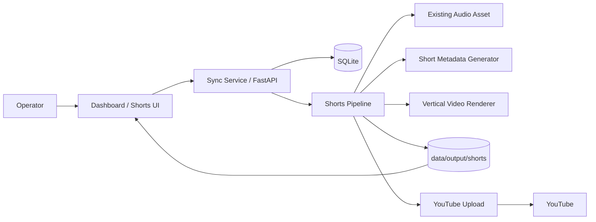

# Shorts Expansion Plan

This document defines a practical plan for extending Whispers of the Seven Kingdoms so the platform can create, manage, and upload **YouTube Shorts** alongside the existing long-form workflow.

The goal is to keep the design **simple, production-minded, and incremental**.

## 1. Goal

Add support for a second publishing format:

- **Long-form ambient videos** (existing)
- **YouTube Shorts** (new)

The first implementation should let an operator create a Short from an existing audio asset, render it in vertical format, review it in the dashboard, and upload it through the existing YouTube integration.

## 2. Product intent

Shorts should initially serve three purposes:

1. **Promotion** for long-form content
2. **Additional distribution surface** for the same creative universe
3. **Fast publishing experiments** without requiring a full long-form run

## 3. Principles

- Build Shorts as an **extension of the current system**, not a parallel platform
- Reuse existing pipeline and upload components wherever reasonable
- Keep the first version **manual and explicit**, not “AI magic”
- Maintain clear separation between **long-form outputs** and **short-form outputs**
- Make Shorts visible in the dashboard and operational views

## 4. Scope

### Phase 1 scope (MVP)
The MVP should support:

- create a Short from an **existing audio track**
- choose clip window / duration
- render in **9:16 vertical format**
- generate Short-specific metadata
- upload through the existing YouTube client
- view job history and logs in the dashboard

### Explicitly out of scope for MVP
- automatic clip discovery
- batch generation of many Shorts
- advanced caption overlays
- sophisticated motion graphics
- analytics dashboards
- automatic “teaser from every longform run” generation

## 5. User workflow

### MVP workflow
1. Open the dashboard
2. Go to the new **Shorts** section
3. Choose an existing audio asset
4. Define title, slug, theme, and clip duration
5. Choose a visual style
6. Generate Short metadata
7. Render a vertical Short
8. Review the result
9. Upload to YouTube

### Future workflows
Later phases may also support:
- Short from an existing pipeline run
- Short from a generated teaser segment
- native Short-first content creation

## 6. Architecture overview

## 7. Repository impact

## Dashboard / service layer
Likely additions:
- `services/sync/templates/shorts.html`
- `services/sync/templates/short_detail.html`
- `services/sync/app/main.py` route expansion or dedicated `shorts.py`
- `services/sync/app/store.py` data model updates

## Pipeline layer
Likely additions:
- `pipeline/scripts/video/render_short.py`
- `pipeline/scripts/metadata/shorts_metadata.py`
- `pipeline/shorts_pipeline.py` or a short mode in the existing pipeline
- possible small extension in `pipeline/scripts/publish/youtube_upload.py`

## Documentation
Recommended additions:
- `docs/guides/SHORTS.md`
- `docs/technical/shorts-reference.md`
- dashboard user-facing documentation page later

## 8. Data model proposal

Shorts can either be stored in a dedicated table / entity or as a typed extension of existing runs.

### Recommended direction
Use a **typed extension of the existing run model** where practical, with explicit fields for short-specific behavior.

### Proposed fields
- `content_type` → `longform | short`
- `format` → `youtube_longform | youtube_short`
- `aspect_ratio` → `16:9 | 9:16`
- `source_run_id` → optional reference to a long-form run
- `source_audio_path`
- `clip_start_seconds`
- `clip_duration_seconds`
- `visual_mode`
- `output_path`
- `youtube_video_id`
- `upload_status`

If this becomes awkward in the current schema, a dedicated `short_runs` table is acceptable.

## 9. Output structure

To avoid mixing long-form and short-form artifacts, keep outputs separate.

### Proposed paths
- `data/output/youtube/` → long-form outputs
- `data/output/shorts/` → Shorts outputs
- `data/upload/shorts/audio/`
- `data/upload/shorts/metadata/`
- `data/upload/shorts/visuals/`

## 10. Rendering model

## Technical requirements
The Short renderer should support:
- resolution: **1080x1920**
- maximum duration: **60 seconds**
- optional fade in/out
- title-safe visual framing
- simple visual composition suitable for ambient branding

## Recommended MVP visual modes
- static branded artwork
- blurred-background version of source artwork
- optional subtle loop / particle layer later

The first version should favor **clarity and speed over visual complexity**.

## 11. Metadata model

Shorts should not simply inherit long-form metadata unchanged.

### Differences from long-form
- shorter titles
- shorter descriptions
- stronger hook in the first line
- curated, compact tags
- optional `#shorts` usage depending on publishing strategy

### Proposed component
- `pipeline/scripts/metadata/shorts_metadata.py`

## 12. Upload model

There is no fundamentally separate “Shorts upload API” in YouTube for this workflow.

The existing upload client should likely be reusable if the system ensures:
- vertical output
- short duration
- short-appropriate metadata
- clear output separation and validation

### Validation checks before upload
- duration <= 60 seconds
- expected resolution / aspect ratio
- required metadata present
- output file exists and is readable

## 13. Dashboard proposal

## Navigation
Add a new main navigation item:
- **Shorts**

### Shorts landing page
The page should include:
- create new Short action
- list of recent Shorts
- current job statuses
- failed jobs / retry options

### Create form
Fields for MVP:
- title
- slug
- source audio
- clip start
- clip duration
- theme / house
- visual mode
- visibility

### Detail page
Each Short detail page should show:
- render status
- logs
- preview / downloadable output
- upload status
- resulting YouTube link, when available

## 14. Sync service / operations impact

Shorts should be visible as first-class operational objects.

### Recommended event model
- `short.created`
- `short.render.started`
- `short.render.completed`
- `short.upload.started`
- `short.upload.completed`
- `short.failed`

### Recommended ops filters
- filter by `content_type`
- filter by upload status
- recent short jobs
- failed short jobs

## 15. Implementation phases

## Phase 1 — MVP
Deliver:
- Shorts dashboard section
- create Short from existing audio
- vertical renderer
- short metadata generation
- upload support
- history + logs

### Acceptance criteria
- operator can create a Short from an existing track
- rendered output is vertical and <= 60s
- metadata is stored separately from long-form metadata
- upload can be triggered from the dashboard
- completed Short appears in dashboard history

## Phase 2 — UX improvement
Deliver:
- browser preview
- templates / presets for visual styles
- improved validation feedback
- source linkage to long-form runs
- duplicate / retry behavior

### Acceptance criteria
- operator can preview Shorts before upload
- errors are explainable in the UI
- Short has traceable relation to source content when applicable

## Phase 3 — growth features
Deliver:
- teaser generation from long-form runs
- multiple Shorts from one source
- title / hook templates
- analytics hooks

### Acceptance criteria
- one long-form asset can produce multiple managed Shorts
- repeatable teaser workflow exists
- operational reporting distinguishes long-form vs short-form outcomes

## 16. Open decisions

The team should explicitly decide:

1. Are Shorts only created from existing audio in v1, or also from native short audio generation?
2. Should the first release support only static visuals, or also subtle animation?
3. Should short data live in the existing runs model or a dedicated store?
4. Are Shorts mainly a promotion funnel for long-form videos, or an equally independent format?
5. Should the dashboard eventually support bulk teaser generation from completed long-form runs?

## 17. Recommendation

The most pragmatic first implementation is:

1. Add a **Shorts** navigation item
2. Build a **manual Short creation flow** from existing audio
3. Render **1080x1920** video
4. Keep duration between **15 and 60 seconds**
5. Generate **Short-specific metadata**
6. Reuse the existing upload path where possible
7. Show history and logs in the dashboard

This creates a useful production feature quickly without destabilizing the main long-form workflow.
