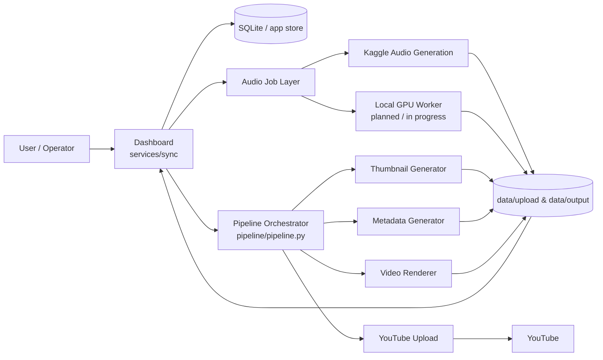

# System Architecture

This document gives a simple, implementation-grounded overview of how the current Whispers of the Seven Kingdoms system fits together.

It is intentionally **high signal and low drama**: enough detail to onboard contributors and support architecture decisions without turning into enterprise fan fiction.

## Purpose

The platform automates a publishing workflow for long-form Game of Thrones-themed ambient music:

1. Choose a house / theme in the dashboard
2. Generate or obtain audio
3. Produce thumbnail and metadata
4. Render a video
5. Review output
6. Upload to YouTube

## Architectural principles

- **Monorepo, clear boundaries**: one repo, but distinct areas for dashboard, pipeline, and model assets
- **Dashboard-first operations**: user-facing workflow lives in `services/sync/`
- **Pipeline as orchestration**: rendering, metadata, and publishing are composed steps, not one giant script blob
- **Provider abstraction for audio**: Kaggle exists today; local GPU worker is the strategic direction
- **File-system-backed outputs**: generated assets land in predictable directories for inspection and reuse

## High-level architecture

## Repository-level component map

### 1. Dashboard and coordination layer
**Path:** `services/sync/`

Responsible for:
- FastAPI application and routes
- Jinja2 dashboard UI
- task / lease / event visibility
- audio job management
- server and operations views
- persistence via local SQLite store

Key files called out in project docs:
- `app/main.py`
- `app/store.py`
- `app/kaggle_gen.py`
- `templates/`
- `static/css/admin.css`

### 2. Pipeline layer
**Path:** `pipeline/`

Responsible for:
- end-to-end orchestration
- taking a slug / project context and turning it into final assets
- coordinating generation, packaging, rendering, and upload steps

Core entry point:
- `pipeline/pipeline.py`

Subsystems:
- `scripts/thumbnails/`
- `scripts/video/`
- `scripts/metadata/`
- `scripts/publish/`

### 3. Audio generation layer
**Primary current path:** `musicgen/`

Current state:
- Kaggle-backed notebook workflow is implemented
- dashboard can patch notebook inputs and poll job status
- generated audio lands in shared project storage

Strategic direction:
- move toward a local GPU worker as the preferred foundation
- keep provider abstraction so Kaggle / Colab / local execution can coexist

### 4. Shared data layer
**Paths:** `data/upload/`, `data/output/`, dashboard-managed state

Used for:
- generated songs
- rendered videos
- metadata artifacts
- reviewable outputs
- pipeline handoff between components

### 5. External dependencies
- **Kaggle** for remote GPU-backed audio generation
- **YouTube Data API v3** for publishing
- **ffmpeg** for media rendering
- **OAuth2 credentials** for upload authorization

## Main runtime flow

### Content creation flow
1. Operator starts in the dashboard
2. House defaults and content parameters are selected
3. Audio generation is triggered via configured provider
4. Audio artifact is stored under project data paths
5. Pipeline runs metadata, thumbnail, and video rendering
6. Final output is reviewed and optionally uploaded

### Operations flow
1. Dashboard surfaces recent runs, audio jobs, tasks, and events
2. SQLite-backed app state tracks operational context
3. `PROJECT_STATUS.md` acts as human-readable project coordination state

## Current architecture strengths

- Clear operational center of gravity in the dashboard
- End-to-end pipeline already assembled
- Reasonable separation between UI, orchestration, and content-generation layers
- Good basis for expanding audio providers without rewriting the whole stack

## Current architecture risks / gaps

- Kaggle path exists but is not yet the desired long-term foundation
- Local GPU worker path is still being operationalized
- Some documentation still reflects older structure and naming
- Large generated artifacts may require LFS or stricter repository hygiene

## Near-term target state

The likely near-term architecture is:
- **Dashboard remains the operator control plane**
- **Pipeline remains the deterministic execution layer**
- **Local GPU worker becomes the preferred audio backend**
- **Kaggle / Colab remain fallback or overflow options**

## Related documents

- [`../../PROJECT_STATUS.md`](../../PROJECT_STATUS.md)
- [`../DIATAXIS_MIGRATION_PLAN.md`](../DIATAXIS_MIGRATION_PLAN.md)
- [`TECH_DECISIONS.md`](TECH_DECISIONS.md)
- [`../technical/repo-structure.md`](../technical/repo-structure.md)
