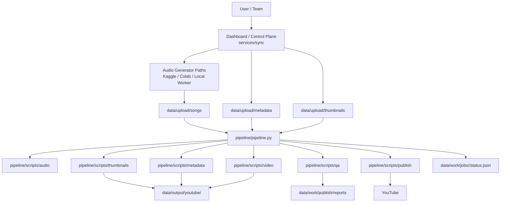

# Architecture Diagram

Dieses Diagramm zeigt die aktuelle Systemstruktur auf hoher Ebene.

Es ist bewusst simpel gehalten: verständlich > beeindruckend.

## High-Level Overview

## Interpretation

- `services/sync/` ist die **Control Plane**
- `pipeline/` ist der **Produktionspfad**
- `data/` ist die operative Datei- und Statusschicht
- Audio-Generatoren sind austauschbare vorgelagerte Quellen
- Upload ist bewusst nur ein späterer Schritt, nicht die einzige Wahrheit des Systems

## Wichtige Architekturidee

Die Pipeline soll möglichst **nicht hart an einen einzelnen Audio-Provider gekoppelt** sein.
Wichtig ist am Ende, dass gültiges Audio + Metadaten + optional Thumbnail vorliegen.
